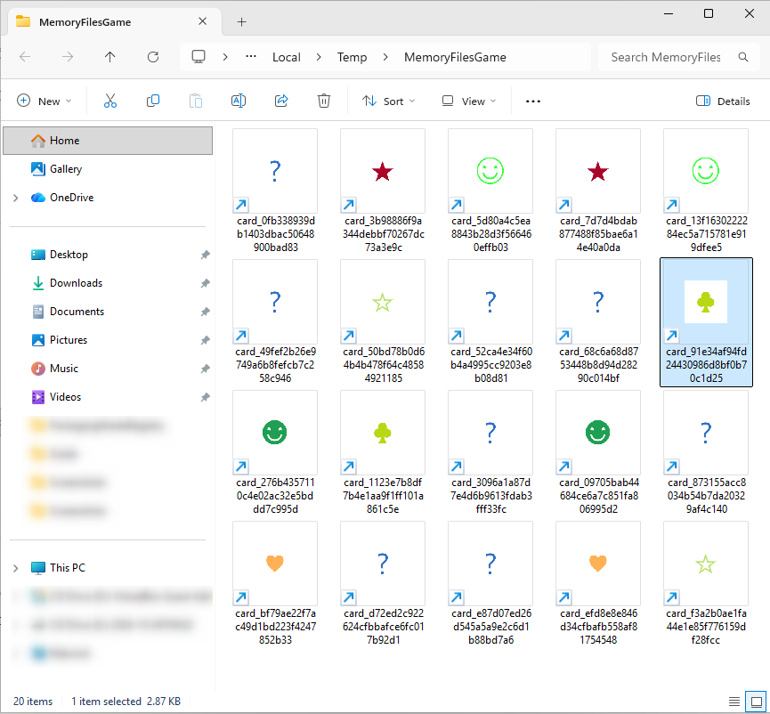
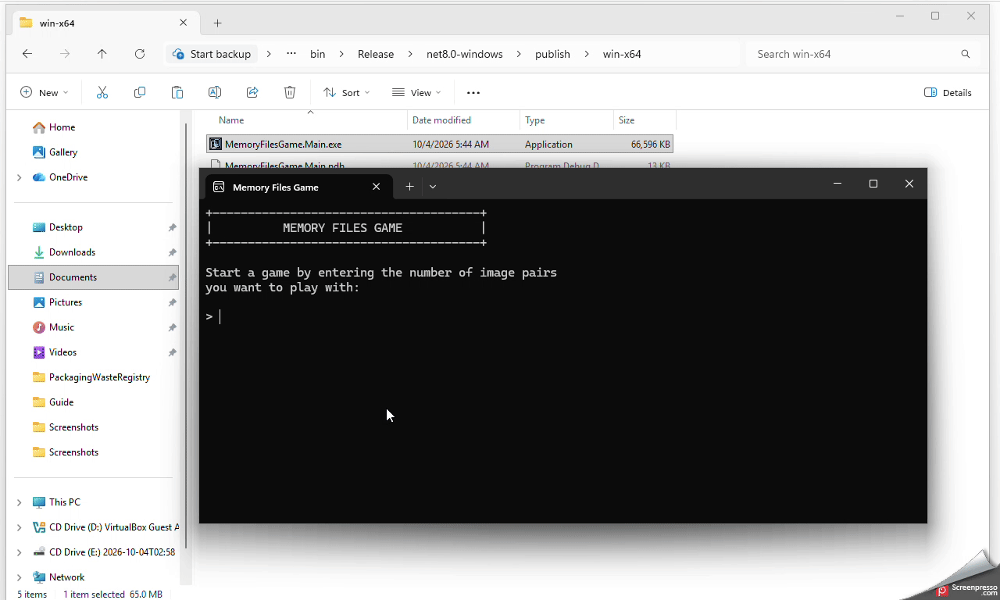

# Memory Files Game

A Windows Explorer-based memory game: match pairs by opening file shortcuts rather than cards in a traditional game window.
 

## How it works

1. The game chooses expressive Unicode symbols (such as `☀`, `♥`, `♛`, and `⚡`) and renders each one as an SVG source, PNG image, and high-resolution ICO icon.
2. Every symbol becomes a pair of randomly named Windows shortcuts in `%TEMP%\MemoryFilesGame`.
3. All shortcuts start with the same question-mark icon. Opening a shortcut briefly runs a hidden handler that flips its icon; matching pairs stay revealed, while mismatches flip back.
4. The handler exits immediately after each action—there is no always-running background process. Game data, images, icons, and state are kept separately under `%LOCALAPPDATA%\MemoryFilesGame`.

When all pairs are found, the game shows the completion time and number of moves, with options to play again or exit.

## GIF demo
In this demo you can see example of the game:  
 

## Authors
- tashkoskim@yahoo.com
